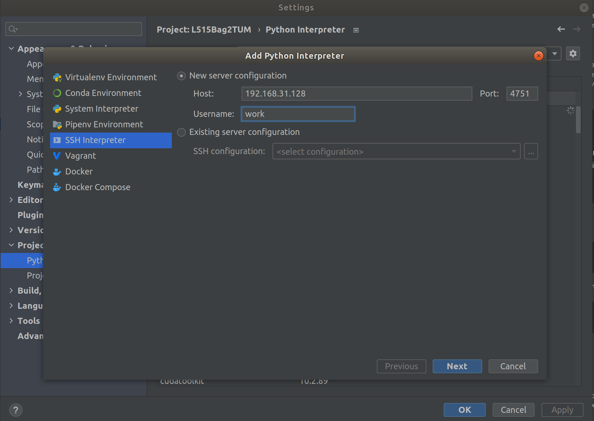
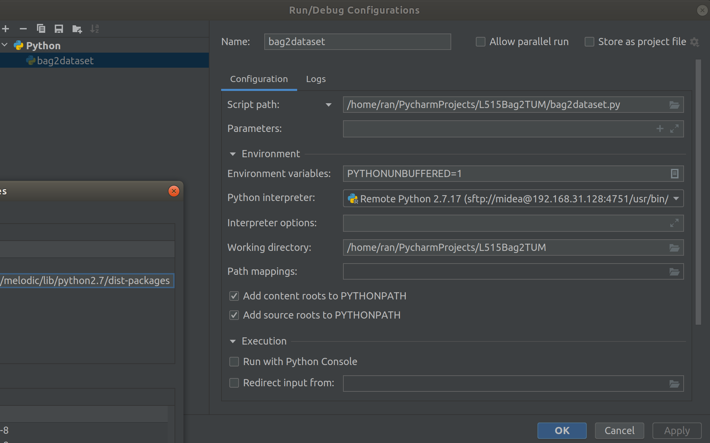
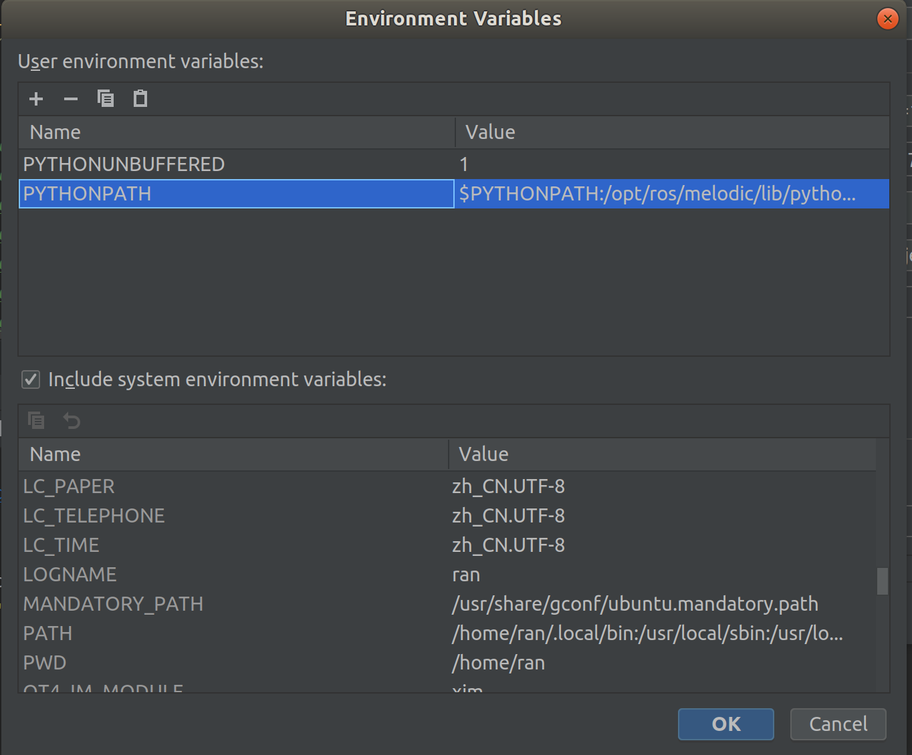

# L515Bag2TUM

Convert the L515 rosbag recorded in ros environment to TUM format dataset.

### Record ROS Bag

To run the L515 or Azure Kinect use the following command:

```shell
# Realsense L515
roslaunch realsense2_camera rs_camera.launch \
device_type:=l515 enable_gyro:=true enable_accel:=true \
align_depth:=true unite_imu_method:=linear_interpolation \
color_width:=1280 color_height:=720 color_fps:=30 \
depth_fps:=30 enable_pointcloud:=true

# Azure Kinect
roslaunch azure_kinect_ros_driver driver.launch \
depth_mode:=WFOV_2X2BINNED \
color_resolution:=720P \
fps:=30 \
imu_rate_target:=200
```

To run the rosbag if you want to record the `raw imu` ,`rgb`, `depth` with point cloud topics:

```shell
# Realsense L515
rosbag record /camera/aligned_depth_to_color/image_raw \
/camera/color/image_raw /camera/imu /camera/depth/metadata \
/camera/color/metadata /camera/color/camera_info \
/camera/depth/color/points

# Azure Kinect
rosbag record /rgb/image_raw \
/depth_to_rgb/image_raw /imu \
/depth_to_rgb/camera_info /rgb/camera_info \
/points2
```

### Prepare Remote ROS debug Environment

 - Preapare the docker environment
 - Run the script within the environment

build the docker image 

```shell
cd docker
./build-docker-image.bash
```

run the image
```shell
./run-docker-container.bash
```

you can customize your own ssh port in `./run-docker-container.bash` through here:
```shell
...
docker run --rm \
  --ipc=host \
  --gpus all \
  --privileged \
  -p 4751:22 \   <====== modify your own port here
  -v /tmp/.X11-unix:/tmp/.X11-unix:rw \
  ...
```

config the remote interpreter in `PyCharm` like this:



don't forget to add the path to your remote interpreter path maps:



Edit the configs for your script and change the `Environment Variables`:

Click on `bag2dataset` → `Edit Configurations`. Under `Environment` → `Environment Variables` click on `Edit environment variables` and add an environment variable with

 - Name: `PYTHONPATH`
 - Value: `$PYTHONPATH:/opt/ros/noetic/lib/python2.7/dist-packages:/home/ros/ros_ws/devel/lib/python2.7/dist-packages`

The variable set is shown below:



Apply the settings and close the window. Then, you can use the play and debug icons to execute the script either in run or debug mode.


### Run Converter

To convert the bag file, simply run:

```shell
# bag2dataset.py bag_filename.bag output_path color_topic_name
python bag2dataset.py \
    /mnt/Data/Datasets/VINS_L515/2022-04-20-20-45-15.bag \
    /mnt/Data/Datasets/VINS_L515/2022-04-20-20-45-15 \
    color
```